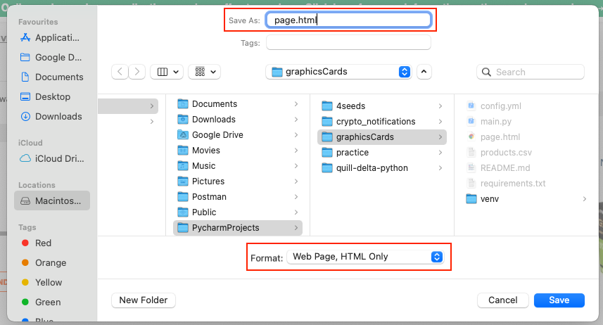

# Jesse's Graphics Card Scraper

## Getting started

To get started follow the instructions below

1. Install python 3.x
2. (Optional) Create a virtual env and activate it
3. Run `pip install -r requirements.txt`
4. Create a `config.yml` file in the root with the following format
   ```yaml
   products:
     - RTX 3060
     - GTX 7070
   ```

## How to use

1. Navigate
   to [this page](https://www.wootware.co.za/computer-hardware/video-cards-video-devices/shopby/in_stock_with_wootware-stock_coming_soon?dir=asc&limit=100&order=price)
2. CTRL + S (save the page) to this (root) directory as `page.html` (see screenshot below)
3. (Optional) if you have a virtual env, activate it
4. Delete the previous `products.csv` file
5. Run `python main.py`
6. Enjoy the `products.csv` file

### Saving the webpage

How to save the webpage dialog:

